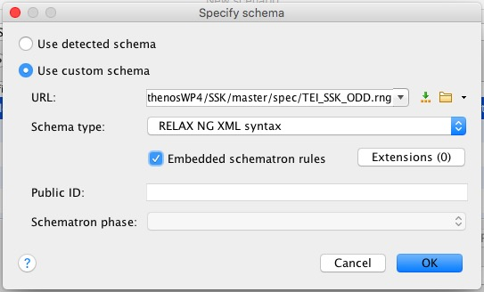

This page contains the resources needed to take workshops about the [Standardization Survival Kit](http://ssk.huma-num.fr).

## Purpose of the workshops

1. Stress the importance of documenting research best practices;
1. Document them with the Standardization Survival Kit.

The expected result of the SSK workshops is the creation and/or review research scenarios.

#### Workshops pages

Each workshop focuses on specific topics, and has its own workspace:
1. **SSK Vienna Workshop, January 31st - February 1st 2019 // [Go to workshop space](Vienna19)**
2. **SSK 3D Worksop (Marseille), February 25-27 2019 //
  [Go to workshop space](Marseille19)**


## The SSK in 5 minutes

### Concept
The Standardization Survival Kit (SSK) is a tool that supports the digital evolution within Social Sciences and Humanities research, by giving access to standards and best practices in a meaningful way, with the mediation of research scenarios. A research scenario is a (digital) workflow practiced by researchers, that can be repeatedly applied to a task that will help to gain material or insights in view of a research question.

These scenarios are at the core of the SSK, as they embed resources with contextual information and relevant examples on standardized processes and methods in a research context. The SSK is an open tool where users are able to publish new scenarios or adapt existing ones. These scenarios can be seen as a living memory of what should be the best research practices in a given community, made accessible and reusable for other researchers.

### A presentation of the SSK

<object data="img/SSK_19_WS.pdf" type="application/pdf" width="700px" height="700px">
    <embed src="img/SSK_19_WS.pdf">
        <p>This browser does not support PDFs. Please download the PDF to view it: <a href="img/SSK_19_WS.pdf">Download PDF</a>.</p>
    </embed>
</object>

### SSK's survival kit
* Website: [http://ssk.huma-num.fr](http://ssk.huma-num.fr)
* Source: [https://github.com/ParthenosWP4/SSK](https://github.com/ParthenosWP4/SSK)
* Documentation: [https://ssk.readthedocs.io](https://ssk.readthedocs.io)
* Bibliography:
  * Charles Riondet, Dorian Seillier, Lionel Tadjou, Laurent Romary. Standardization Survival Kit (Final). [Technical Report] Inria Paris. 2018. [〈hal-01925144〉](https://hal.inria.fr/hal-01925144)
  * Marie Puren, Charles Riondet, Laurent Romary, Dorian Seillier, Lionel Tadjou. SSK by example. Make your Arts and Humanities research go standard. Digital Humanities 2018 : "Bridges/Puentes", Jun 2018, Mexico, Mexico. https://dh2018.adho.org/en/. [〈hal-01848882〉](https://hal.inria.fr/hal-01848882)
  * Marie Puren, Charles Riondet, Laurent Romary, Dorian Seillier, Lionel Tadjou. The Standardization Survival Kit (SSK): Bringing best practices to research communities in the Humanities. Digital Humanities Benelux 2018, Jun 2018, Amsterdam, Netherlands. https://dhbenelux.socialhistoryservices.org/. [〈hal-01850075〉](https://hal.inria.fr/hal-01850075)


## Create a scenario

To help users create a scenario, two main resources are available:

1. A tutorial;
2. The documentation of the SSK TEI model.

### How to write a scenario for the SSK?

1. A tutorial with formal guidelines for creating a scenario can be found in the SSK documentation:
***[SSK Tutorial](https://ssk.readthedocs.io/en/latest/1_tuto.html)***

1. The documentation of the TEI data model can be found here:
***[SSK TEI model](https://ssk.readthedocs.io/en/latest/2_ssktei.html)***


### TEI workflow


Scenarios and steps are encoded with the standard [XML-TEI](http://tei-c.org/). All the information displayed within the SSK proceed from TEI files, hosted on the GitHub repository:
* scenarios: https://github.com/ParthenosWP4/SSK/tree/master/scenarios
* steps: https://github.com/ParthenosWP4/SSK/tree/master/steps


#### Every TEI file must be validated against the [SSK TEI schema](https://ssk.readthedocs.io/en/latest/2_ssktei.html#schema).

In case you want to start from scratch, the link to add in the XML declaration is the following:
https://raw.githubusercontent.com/ParthenosWP4/SSK/master/spec/TEI_SSK_ODD.rng

```xml
<?xml version="1.0" encoding="UTF-8"?>
<?xml-model href="https://raw.githubusercontent.com/ParthenosWP4/SSK/master/spec/TEI_SSK_ODD.rng"
            type="application/xml"
            schematypens="http://relaxng.org/ns/structure/1.0"?>
```

#### Template file for scenarios and steps can be used:
  * [scenario template file](https://github.com/ParthenosWP4/Workshops/blob/master/SSK_Scenario_template.xml)
  * [step template file](https://github.com/ParthenosWP4/Workshops/blob/master/SSK_step_template.xml)

#### Keywords

The SSK scenarios and steps are described with the help of selected vocabularies, among which the most relevant is the [TaDirAH Taxonomy](https://github.com/dhtaxonomy/TaDiRAH):

* [Research activities](http://tadirah.dariah.eu/vocab/index.php?tema=6)
* [Research techniques](http://tadirah.dariah.eu/vocab/index.php?tema=92)
* [Research objects](http://tadirah.dariah.eu/vocab/index.php?tema=55)

Other list of terms used in the SSK are:
* [Standards](http://ssk.huma-num.fr/#/glossary/standards), from the SSK Standard Knowledge base (supported by DARIAH-IT)
* [Disciplines](http://ssk.huma-num.fr/#glossary/disciplines), taken from [aureHAL](https://aurehal.archives-ouvertes.fr/domain/index)

See the [SSK Glossary](http://ssk.huma-num.fr/#glossary/) for a complete overview of all available terms.

**New trick**

In the [SSK Glossary](http://ssk.huma-num.fr/#glossary/), a button copies the exact TEI code:


Clicking on the **&lt;/&gt;** symbol copies the following:

```xml
<term key="Archaeology and Prehistory" source="AureHAL" type="discipline"/>
```

**NB:** It is possible to add new standards entries to the list.
Copy the template file available [here](https://github.com/ParthenosWP4/SSK/blob/master/standardsKB/standardTemplate.json), fill the requested information (JSON syntax) and send it to `ssk [at] inria [dot] fr`

#### Validate XML files

The validation of the SSK TEI files consists of two steps:
* An classic XML validation with a RELAX NG schema
* Content-oriented validation with Schematron.


##### The &lt;oXygen/&gt; XML Editor software makes it easy to validate TEI files.

To create a specific SSK validation scenario in &lt;oXygen/&gt;, see this page for more information: https://www.oxygenxml.com/doc/versions/18/ug-editor/tasks/create-validation-scenario.html

**Important** It is necessary to specify the schema used (see the *Schema* section of the document linked above). The settings are the following:
* Select `Use custom schema`
* URL: https://raw.githubusercontent.com/ParthenosWP4/SSK/master/spec/TEI_SSK_ODD.rng
* Schema Type:  `RELAX NG XML syntax`
* Select `Embedded schematron rules`



NB: A trial version of &lt;oXygen/&gt; is available [here](https://www.oxygenxml.com/xml_editor/register.html)

##### It is also possible to generate a validation report with a Python script.

This method will output CSV reports with the schematron errors, but won't validate the XML.

###### Installation

* It requires Python 3 (and pip) and Java (see [here](https://www.java.com/en/download/)).
* [Clone](https://github.com/ParthenosWP4/Workshops.git) or [download](https://github.com/ParthenosWP4/Workshops/archive/master.zip) this repository (ParthenosWP4/Workshops).
* On the console, go to the *validation/* folder
* Run the following command
```
pip install -r requirements.txt
```

###### Usage

Run the python script validation.py with two parameters:
* the path to the **scenario** you want to validate as parameter 1
* the path to **the folder of the steps** you want to validate as parameter 2

```shell
validation$ python validation.py ../Vienna19/corpusModellinginTEI ../Vienna19/corpusModellinginTEI/steps
```
**NB:** You may need to replace `python` by `python3`, depending on your installation.
**NB2:** For Windows, you also need to use backslahes for the pathes (`..\Vienna19\corpusModellinginTEI`).

###### Result

If the script runs successfully, it should create in *validation/* a new folder called  `reports_{Name of the scenario}_{date}_{time}`, containing reports for the scenarios checked and its steps.

There is one folder per scenario with:
* A readme file contains links to the TEI files on the SSK Github, so that you can identify quickly the file corresponding to the report:  
**NB:** they share almost the same name: `theScenario.xml` // `theScenario_report.csv`

* A csv table : the report for the scenario file
* A folder containing the reports for each steps.

These reports are tables that contain the following information, related to the XML file checked:
1. `location`:  In which precise XML element the issue was raised;
1. `line`: The line number of the previous location (Caveat, when the message is related to the root element TEI, there is no line number, but you have to check the root (between line 3 to 5, more or less);
1. `role`: Three possible values:
  * `error`: Something is missing or badly formatted and needs to be corrected;
  * `warning`: It is strongly recommended to take the message into account, but it’s not mandatory;
  * `information`: The message gives a piece of information, but an action is not necessarily required.
1. `message`: A suggestion of what you could do to solve the problem (The most important).

**Important note:**
The messages listed in the tables are not always synonyms of errors in the file, you have to consider them rather like guidelines to check if the corresponding content is correct or not.
